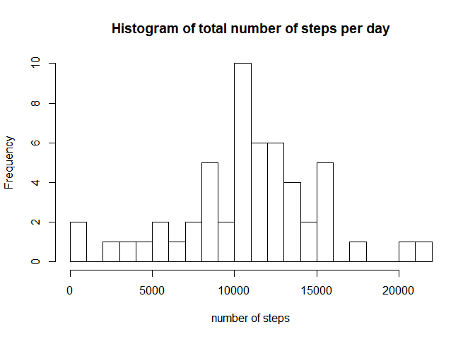
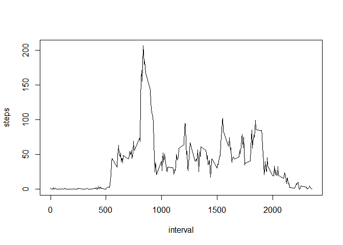
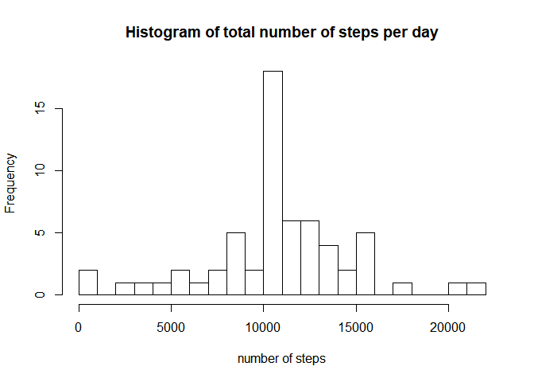

## Loading and preprocessing the data

```r
activity <- read.csv(unz("activity.zip","activity.csv"))
```


## What is mean total number of steps taken per day?

```r
hist(aggregate(steps~date, data=activity, sum)$steps, xlab = "number of steps", main = "Histogram of total number of steps per day", breaks = 20)
```

<!-- -->

```r
mean(aggregate(steps~date, data=activity, sum)$steps)
```

```
## [1] 10766.19
```

```r
median(aggregate(steps~date, data=activity, sum)$steps)
```

```
## [1] 10765
```

## What is the average daily activity pattern?

```r
int <- aggregate(steps~interval, data = activity, mean)
with(int,plot(interval,steps,type = "l"))
```

<!-- -->

```r
max_int <- sprintf("%02d:%02d", as.numeric(int[int$steps==max(int$steps),1])%/%100,as.numeric(int[int$steps==max(int$steps),1])%%100)
```
**The interval with maximum number of steps is 08:35**

## Imputing missing values

```r
sum(is.na(activity$steps))
```

```
## [1] 2304
```
1. We fill the missing value in Activity dataset with the mean for that 5-minute interval. We use the "int" data.frame to fill the missing values. 

```r
activity[is.na(activity$steps),"steps"] <- int[,"steps"]
```
2. Creating a new dataset that is equal to the original dataset but with the missing data filled in

```r
write.csv(activity, file="full_activity.csv")
```
3. Make a histogram of the total number of steps taken each day and Calculate and report the mean and median total number of steps taken per day. Do these values differ from the estimates from the first part of the assignment? What is the impact of imputing missing data on the estimates of the total daily number of steps?

```r
hist(aggregate(steps~date, data=activity, sum)$steps, xlab = "number of steps", main = "Histogram of total number of steps per day", breaks = 20)
```

<!-- -->

```r
mean(aggregate(steps~date, data=activity, sum)$steps)
```

```
## [1] 10766.19
```

```r
median(aggregate(steps~date, data=activity, sum)$steps)
```

```
## [1] 10766.19
```
Since we filled the dataset with the mean for that 5-minute interval and since the NA values are all day long, then the frequency of the mean total number of steps per day increases. For the same reason the mean total number of steps remains equal, while the median increases a little bit. 


## Are there differences in activity patterns between weekdays and weekends?

1. Create a new factor variable in the dataset with two levels – “weekday” and “weekend” indicating whether a given date is a weekday or weekend day.

```r
i <- 1
for (d in activity$date){
        activity$part_of_the_week[i] <- switch(weekdays(as.Date(activity$date[i])), "lunedì"= "weekday",  "martedì"= "weekday","mercoledì"= "weekday", "giovedì"= "weekday", "venerdì"= "weekday", "sabato"= "weekend", "domenica"= "weekend")
        i <- i+1
}
```


2. Make a panel plot containing a time series plot (i.e. \color{red}{\verb|type = "l"|}type = "l") of the 5-minute interval (x-axis) and the average number of steps taken, averaged across all weekday days or weekend days (y-axis). See the README file in the GitHub repository to see an example of what this plot should look like using simulated data.

```r
library(lattice)
int2 <- aggregate(steps~interval+part_of_the_week, data = activity, mean)
xyplot(steps ~ interval | part_of_the_week, data = int2, layout= c(1,2), type="l")
```

<!-- -->


